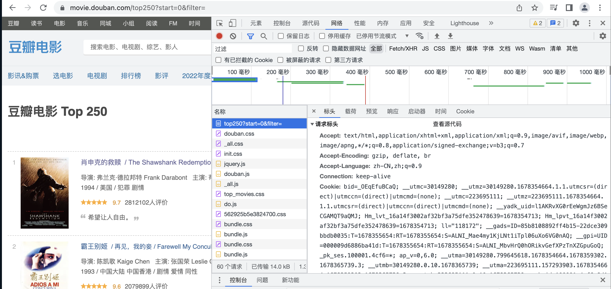
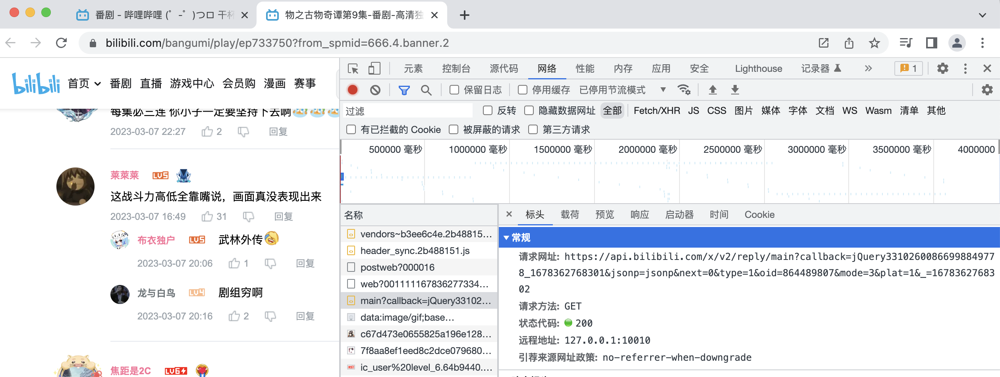
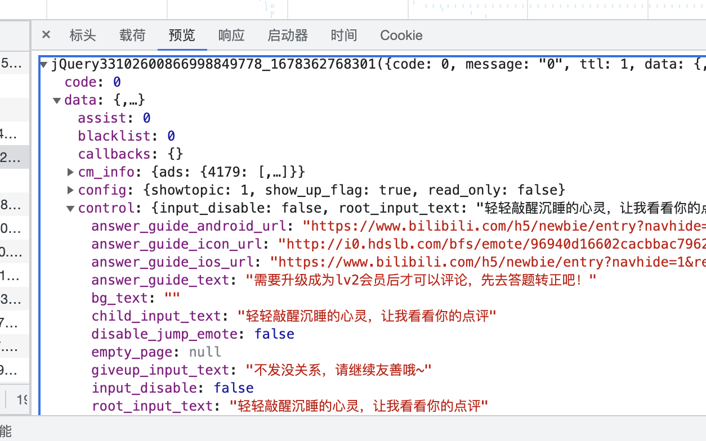

# Go爬虫

**一般的爬虫步骤**

1. 发送请求
2. 解析网页
3. 获取节点信息
4. 保存信息

## 预先准备

### 连接数据库（gorm+mysql）

```go
var DB = Init()
func Init() *gorm.DB {
	dsn := "your_root:your_password@tcp(127.0.0.1:3306)/spider?charset=utf8mb4&parseTime=True&loc=Local"
	db, err := gorm.Open(mysql.Open(dsn), &gorm.Config{})
	if err != nil {
		log.Println("gorm init error:", err)
	}
	return db
}
```

### 编写main函数

这里实现了两种爬虫，所以设计了两个包：

* 静态网页——豆瓣
* 动态网页——bilibili评论区

```go
func main() {
	for i := 0; i < 10; i++ {
		fmt.Printf("正在爬取第 %d 页数据\n", i)
		doubanspider.Spider(strconv.Itoa(i * 25))
	}
	bilibilicommentspider.Spider()
	fmt.Println("爬取完毕")
}
```

## 静态爬虫——豆瓣top250

### 发送请求

```go
	client := http.Client{}
	req, err := http.NewRequest("GET", "https://movie.douban.com/top250?start="+page+"&filter=", nil)
	if err != nil {
		fmt.Println("req err", err)
	}
```

```go
	// 加请求头伪造成浏览器访问
	req.Header.Set("Accept", "text/html,application/xhtml+xml,application/xml;q=0.9,image/avif,image/webp,image/apng,*/*;q=0.8,application/signed-exchange;v=b3;q=0.7")
	req.Header.Set("Accept-Language", "zh-CN,zh;q=0.9")
	req.Header.Set("Cache-Control", "max-age=0")
	req.Header.Set("Connection", "keep-alive")
	req.Header.Set("sec-ch-ua-mobile", "?0")
	req.Header.Set("Sec-Fetch-Dest", "document")
	req.Header.Set("Sec-Fetch-Mode", "navigate")
	req.Header.Set("Sec-Fetch-Site", "")
	req.Header.Set("Sec-Fetch-User", "?1")
	req.Header.Set("Upgrade-Insecure-Requests", "1")
	req.Header.Set("Referer", "https://movie.douban.com/chart")
	req.Header.Set("User-Agent", "Mozilla/5.0 (Macintosh; Intel Mac OS X 10_15_7) AppleWebKit/537.36 (KHTML, like Gecko) Chrome/110.0.0.0 Safari/537.36")

	resp, err := client.Do(req)
	if err != nil {
		fmt.Println("请求失败", err)
	}
	defer resp.Body.Close()
```

上述信息从浏览器开发者获取：



### 解析静态网页

这里使用`"github.com/PuerkitoBio/goquery"`这个包进行解析

```go
	docDetail, err := goquery.NewDocumentFromReader(resp.Body)
	if err != nil {
		fmt.Println("解析失败", err)
	}
```

### 创建数据库表单（用于存储你想爬的信息）

```go
package doubanspider

type MovieData struct {
	Title    string `json:"title"`
	Director string `json:"director"`
	Picture  string `json:"picture"`
	Actor    string `json:"actor"`
	Year     string `json:"year"`
	Score    string `json:"score"`
	Quote    string `json:"quote"`
}

func (table *MovieData) TableName() string {
	return "movie_data"
}
```

**别忘了在数据库设计好这个表单**

### 获取节点信息并保存到数据库

使用网页开发者模式进行搜索想要的selector

```go
docDetail.Find("#content > div > div.article > ol > li").
		Each(func(i int, s *goquery.Selection) {
			title := s.Find("div > div.info > div.hd > a > span:nth-child(1)").Text()
			img := s.Find("div > div.pic > a > img")
			imgTmp, ok := img.Attr("src") // 获取img标签下的src属性内容
			info := s.Find("div > div.info > div.bd > p:nth-child(1)").Text()
			score := s.Find("div > div.info > div.bd > div > span.rating_num").Text()
			quote := s.Find("div > div.info > div.bd > p.quote > span").Text()
			if ok {
				director, actor, year := InfoSpilt(info)
				data := &MovieData{
					Picture:  imgTmp,
					Director: director,
					Actor:    actor,
					Year:     year,
					Title:    title,
					Quote:    quote,
					Score:    score,
				}
				err := config.DB.Model(new(MovieData)).Create(&data).Error
				if err != nil {
					fmt.Println("插入失败")
				}
			}
		})
```

**另外使用正则表达式匹配从info中提取三个字段进行分开存储**

```go
func InfoSpilt(info string) (director, actor, year string) {
	directorRe, _ := regexp.Compile(`导演:(.*)主演`)
	director = string(directorRe.Find([]byte(info)))
	actorRe, _ := regexp.Compile(`主演:(.*)`)
	actor = string(actorRe.Find([]byte(info)))
	yearRe, _ := regexp.Compile(`(\d+)`)
	year = string(yearRe.Find([]byte(info)))
	return
}
```

## 动态爬虫——bilibili视频下的评论

### 发送请求与静态一致，不做讲解

需要注意的是URL不再是普通获取的了 而是需要使用开发者工具搜索：



### 读取信息与解析静态网页不同

1. 先通过网络工具将json转为struct，json从开发者工具获取（转换工具网上随便找个网页），然后删除点不需要的信息

   将一下json数据全部复制到网页进行转为struct：

   

   然后对于转化之后到结果保留需要的信息，最终结果如下（我们仅需要获得一级评论和二级评论即可）：

   ```go
   type BilibiliComment struct {
   	Data struct {
   		Replies []struct {
   			Content struct {
   				Message string `json:"message"`
   			} `json:"content"`
   			Replies []struct {
   				Content struct {
   					Message string `json:"message"`
   				} `json:"content"`
   				Replies interface{} `json:"replies"`
   			} `json:"replies"`
   		} `json:"replies"`
   	} `json:"data"`
   }
   ```

2. 读取信息获得一级标题与二级标题存入数据库

   数据库设计如下：

   ```go
   type BiliComment struct {
   	Comments string `json:"comments"`
   }
   
   func (table *BiliComment) TableName() string {
   	return "bili_comment"
   }
   ```

   ```go
   	// 读取信息
   	bodyText, err := ioutil.ReadAll(resp.Body)
   	if err != nil {
   		fmt.Println("解析失败", err)
   	}
   	var resultList BilibiliComment
   	_ = json.Unmarshal(bodyText, &resultList)
   	for _, result := range resultList.Data.Replies {
   		fmt.Println("一级评论", result.Content.Message)
   		data1 := &BiliComment{
   			Comments: result.Content.Message,
   		}
   		err := config.DB.Model(new(BiliComment)).Create(&data1).Error
   		if err != nil {
   			fmt.Println("插入失败")
   		}
   		for _, replay := range result.Replies {
   			fmt.Println("二级评论", replay.Content.Message)
   			data2 := &BiliComment{
   				Comments: replay.Content.Message,
   			}
   			err := config.DB.Model(new(BiliComment)).Create(&data2).Error
   			if err != nil {
   				fmt.Println("插入失败")
   			}
   		}
   	}
   ```

   